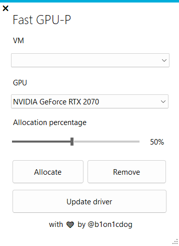

# FastGPUP
A WIP GUI app to make GPU-P way easier!

Based on : https://github.com/jamesstringerparsec/Easy-GPU-PV

## Usage
The usage is simple, choose VM, choose GPU, slide the percentage you want to allocate of it and then press Add.

Drivers should be installed automatically when adding a GPU partition, if you update host drivers you must press "Update driver" for GPU to work in guest.

Windows 10 does not allow GPU selection, this is an Hyper-V limitation.

This tool requires .NET Framework 9.0.
Make sure Bitlocker is disabled or suspended or the mount will not work. 

## To-do
- Detect mismatched guest GPU drivers
- Bulk GPU driver install
- Install additional addons that are usually needed inside VMs (example: dummy video adapter)
- Solve issue where app is unable to remove GPU partitions if GPU is no longer installed
