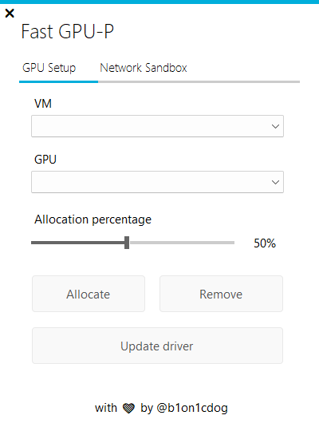
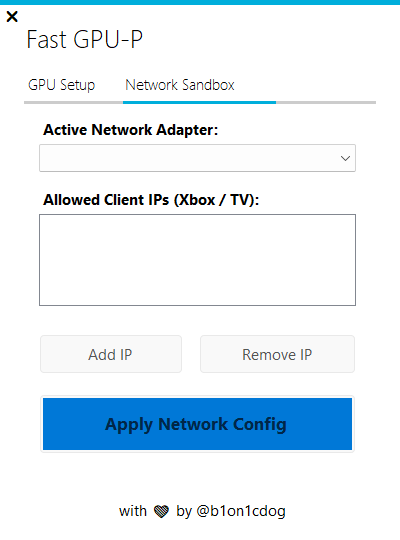

# FastGPUP
A WIP GUI app to make GPU-P way easier!  
Based on : https://github.com/jamesstringerparsec/Easy-GPU-PV

## GPU Setup

The gpu setup is simple: select your VM, select your physical GPU, slide the percentage of VRAM you want to allocate, and press **Allocate**.

* **Drivers:** Drivers are installed automatically when adding a GPU partition. If you update your Host PC's graphics drivers, you must press **Update driver** for the GPU to continue working in the guest.
* **Limitations:** Windows 10 does not allow specific GPU selection (Auto only); this is a strict Hyper-V limitation.
* **Requirements:** This tool requires .NET 10.
* **Warning:** Make sure BitLocker is disabled or suspended on the Host, or the partition mount will fail.



## Network Sandbox (Moonlight / Sunshine)

The Network Sandbox tab allows you to bind your VM's internet connection to an active physical adapter (Wi-Fi, Ethernet).  
It also applies a **Zero-Trust Firewall** using Hyper-V Extended ACLs. It isolates the VM from your local network, while  allowing the IPs in your Whitelist (e.g., Living Room Xbox or Apple TV).



### Initial Manual Setup

To use the Network Sandbox, you must configure your Hyper-V networking. 

**1. Create the Switches**  
In the Hyper-V Virtual Switch Manager, create two switches:
* `External-Net` (External Switch)
* `Moonlight-Internal` (Internal Switch)

**2. Attach & Rename the VM Adapters**  
Attach exactly two Network Adapters to your VM.  
Leave the Public-NIC MAC address on Static to allow DHCP reservation on your router. 

Run this in PowerShell as Administrator (replace `<VM Name>`) to rename them:
```powershell
Get-VMNetworkAdapter -VMName "<VM Name>" | Where-Object SwitchName -eq "External-Net" | Rename-VMNetworkAdapter -NewName "Public-NIC"  
Get-VMNetworkAdapter -VMName "<VM Name>" | Where-Object SwitchName -eq "Moonlight-Internal" | Rename-VMNetworkAdapter -NewName "Private-NIC"
```

**3. Configure Manual IPs**  
* **Host PC**: Open Network Connections, find `vEthernet (Moonlight-Internal)`, and set IPv4 to `172.30.30.1` (Subnet `255.255.255.0`).
* **Inside the VM**: Open Network Connections, find the `Private-NIC`, and set IPv4 to `172.30.30.2` (Subnet `255.255.255.0`).

## To-do

- [ ] Automate the creation of Virtual Switches and Adapter renaming.
- [ ] Bulk GPU driver install
- [ ] Install additional addons that are usually needed inside VMs (example: dummy video adapter)
- [ ] Solve issue where app is unable to remove GPU partitions if GPU is no longer installed
- [ ] Allow precise increment changes on the GPU percentage slider.
